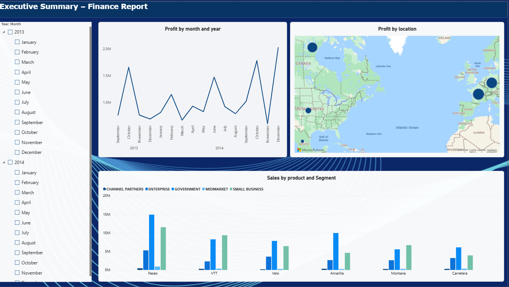

# Financial Report – Power BI

This report was created for educational purposes as part of my Power BI learning.

The project follows an official Microsoft Learn tutorial and uses the Microsoft Financial Sample dataset.

**Skills practiced:** Power BI Desktop, Power Query, DAX, data visualization, slicers and filters.

**Source:** Microsoft Learn – Power BI Financial Sample.
