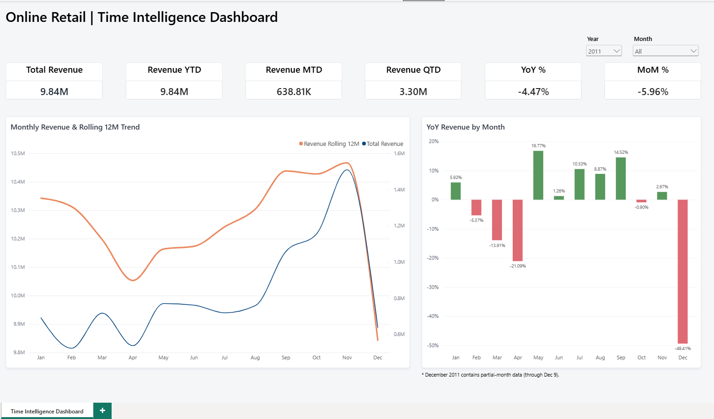

# Online Retail Time Intelligence Dashboard

Power BI dashboard analyzing retail revenue trends using the Online Retail II dataset.

## Key Features
- YTD, MTD & QTD Revenue
- YoY % & MoM %
- Rolling 12-Month Revenue
- Year & Month filters

## Tools
Power BI | Power Query | DAX | Data Modeling

> December 2011 contains partial-month data through Dec 9.
