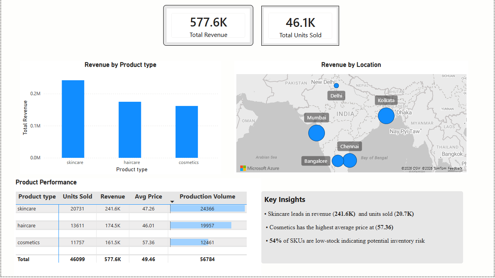
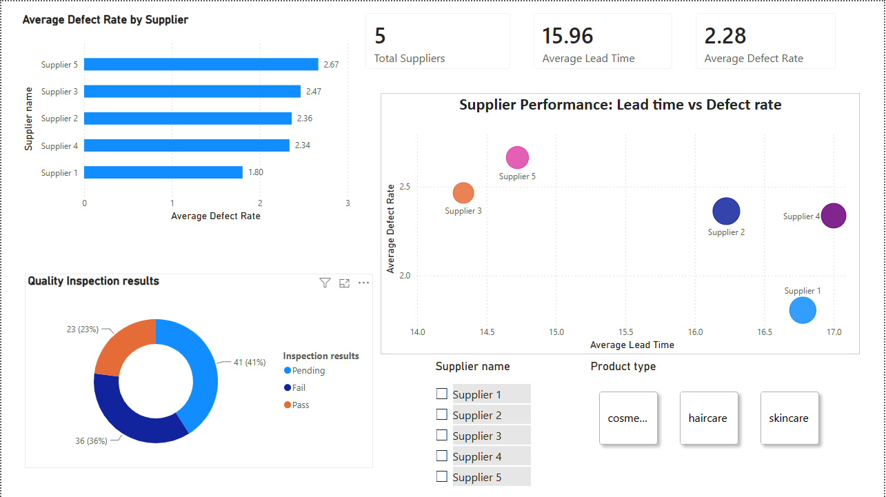
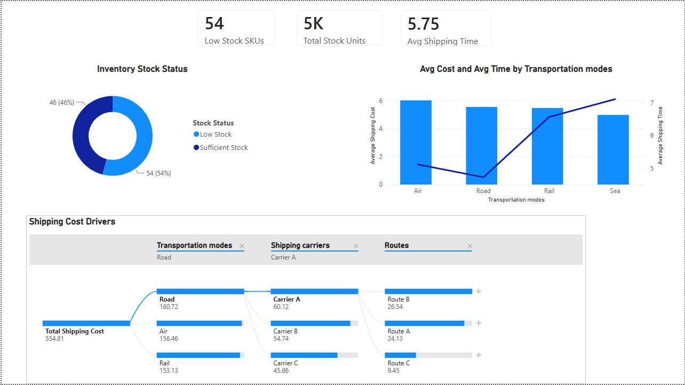

# Supply Chain Analysis | Power BI

Portfolio project completed as part of the Data Analytics course by Naqty Data.

This Power BI project analyzes supply chain performance across revenue, suppliers, product quality, inventory, and logistics.

## Dashboard Pages

- Executive Overview
- Supplier & Quality Analysis
- Inventory & Logistics Analysis

- ## Dashboard Preview

### Executive Overview

### Supplier & Quality Analysis

### Inventory & Logistics Analysis

